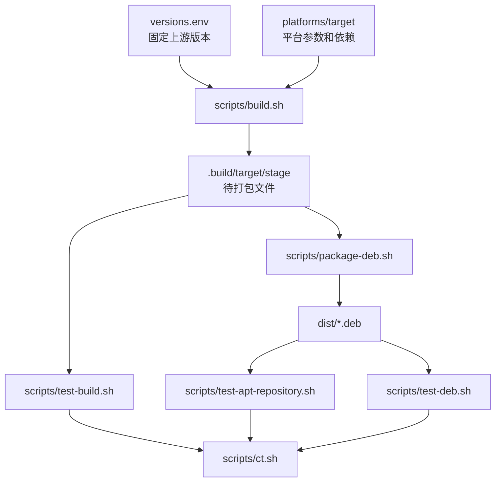
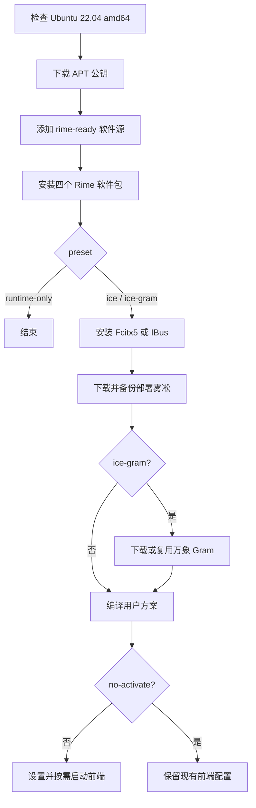
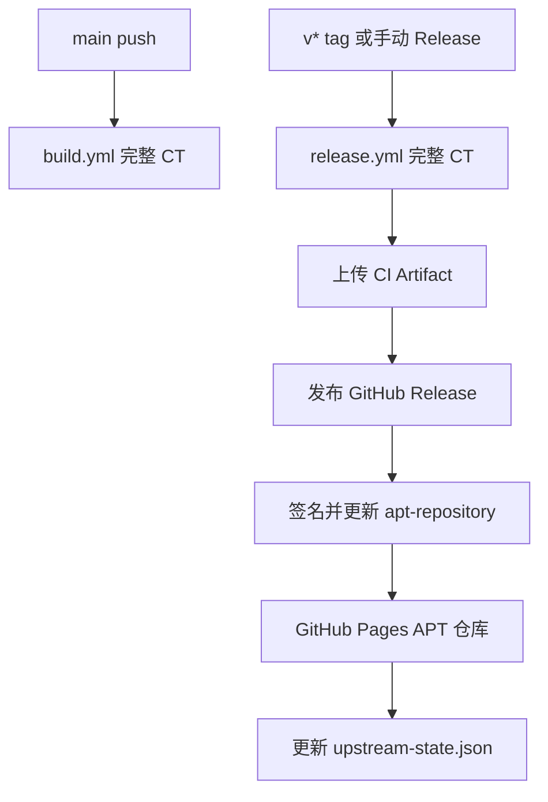

# rime-ready 设计说明

## 项目要解决的问题

Ubuntu 22.04 提供 librime 1.7.3，而新版雾凇使用了较新的 Lua 模块加载方式。直接使用 Jammy 的 Rime 运行库时，新版方案可能无法正确加载或部署。

rime-ready 不替代 Fcitx5、IBus 或雾凇本身。项目负责构建一组版本匹配的 Rime 运行库和工具，把它们发布为标准 Ubuntu 软件包，并提供可选的用户方案安装流程。

项目遵循以下原则：

1. librime、Lua 和 Octagram 使用固定且经过同一轮测试的提交；
2. 系统文件全部由 deb 和 APT 管理，不手工覆盖 `/usr/lib`；
3. deb 不包含用户配置，也不自动激活输入法；
4. 用户明确选择预设后，安装脚本才下载和部署雾凇；
5. GitHub Release 和 APT 仓库只接收通过完整 CT 的产物。

## 组成部分

完整安装由三个来源共同完成：

| 来源 | 提供内容 |
| --- | --- |
| Ubuntu APT | `fcitx5-rime` 或 `ibus-rime`，以及 glibc、ICU、Boost 等系统依赖。 |
| rime-ready APT | librime、Lua、Octagram 和版本匹配的命令行工具。 |
| 雾凇和万象上游 | 用户输入方案、词典和可选 Gram 模型。 |

这三个部分分开发布。升级 Rime 运行库不会覆盖用户词库，安装 deb 也不会修改 Fcitx5/IBus 的当前配置。

## 构建数据流



### 固定版本

[`versions.env`](../versions.env) 是构建版本入口，记录：

- librime Release 版本和提交；
- librime-lua 与 thirdparty 提交；
- librime-octagram 提交；
- 雾凇 Release、Asset ID 和 SHA-256；
- 软件包修订号。

构建不会跟随上游分支的最新提交。这样本地、CI 和 Release 可以得到相同源码组合。

### 平台目录

每个目标位于 `platforms/<target>/`。当前目标 `ubuntu-22.04` 包含：

- `platform.env`：系统 ID、系统版本、deb 后缀和 APT 仓库参数；
- `build-packages.txt`：该平台的构建与测试依赖。

通用脚本通过 `scripts/lib/common.sh` 加载目标配置。新增 Ubuntu 或 Debian 版本时，不应把版本判断散落到每个脚本中。

### 编译和 stage

`scripts/build.sh` 下载固定提交，构建 librime 的基础依赖，再编译核心库和两个插件。安装前缀为 `/usr`，但编译结果先写入：

```text
.build/<target>/stage/
```

stage 模拟软件包安装后的根目录。编译步骤不会直接覆盖宿主机的 `/usr`。

### 软件包拆分

`scripts/package-deb.sh` 从同一个 stage 生成四个二进制包：

| 软件包 | 内容 |
| --- | --- |
| `librime1` | `librime.so.1` 核心动态库。 |
| `librime-bin` | `rime_deployer`、字典管理和补丁工具。 |
| `librime-plugin-lua` | 与核心库匹配的 Lua 插件。 |
| `librime-plugin-octagram` | 与核心库匹配的 Octagram 插件。 |

四个包使用相同版本，并通过精确依赖避免混装。文件安装到 Ubuntu 标准路径，所有权由 `dpkg` 记录。

## 安装流程

`install.sh` 是可通过 `curl | bash` 独立执行的脚本，不依赖仓库内其他文件。默认流程为：



系统软件包通过 `sudo apt` 安装。雾凇目录和输入法配置始终以当前桌面用户身份写入。

更新雾凇前，脚本将原目录重命名为带时间戳的备份目录，并将已有的 `rime_ice.userdb` 复制到新目录。它不会尝试合并其他任意 YAML 配置。

## APT 仓库设计

APT 仓库位于独立的 `apt-repository` 分支，通过 GitHub Pages 发布。目录先按发行版家族分开，再使用该发行版的 suite：

```text
apt/
├── ubuntu/
│   ├── dists/jammy/main/binary-amd64/
│   └── pool/jammy/main/
└── debian/
    ├── dists/<codename>/...
    └── pool/<codename>/...
```

用户的软件源基地址包含发行版家族：

```text
https://huffer342-wsh.github.io/rime-ready/apt/ubuntu
```

这样 Ubuntu 和 Debian 可以各自使用 `jammy`、`bookworm` 等 suite，不会把不同系统的软件包写入同一索引。架构由 `binary-<architecture>` 区分。

`scripts/publish-apt-repository.sh` 执行以下操作：

1. 根据平台配置选择仓库家族、suite、component 和 architecture；
2. 将该目标的 deb 复制到对应 `pool`；
3. 使用 `dpkg-scanpackages --multiversion` 保留多个版本；
4. 生成 `Packages`、`Packages.gz` 和 `Packages.xz`；
5. 生成并保留 SHA-256 By-Hash 文件；
6. 使用 APT 专用密钥签署 `InRelease` 和 `Release.gpg`。

By-Hash 文件不会随新索引立即删除。即使 GitHub Pages CDN 短时间缓存了旧 `InRelease`，APT 仍能按旧哈希读取对应索引。

## 发布流程



`release.yml` 只有在所有 Matrix 目标通过 CT 后才发布。每个平台的 Artifact 保持独立目录，发布 APT 仓库时再根据目标名称读取对应平台配置。

`apt-repository.yml` 用于从已有 GitHub Release 重建某个平台的 APT 索引。它不会重新编译，因此只应选择已经通过 Release Workflow 发布的 Tag。

## 上游更新

`scripts/check-upstream.sh` 和 `upstream-watch.yml` 定期检查：

- librime 正式 Release；
- 形如 `YYYY.MM.DD` 的稳定版雾凇。

Lua 和 Octagram 没有项目采用的稳定 Release，因此自动任务不会直接跟随它们的默认分支。

发现上游更新后，自动任务修改 `versions.env` 并调度 Release。只有构建、ABI、雾凇部署和真实输入输出测试全部成功后，`upstream-state.json` 才记录新版本。

## 测试范围

完整 CT 包含：

1. librime 上游单元测试；
2. 核心库、插件和命令行工具的动态依赖检查；
3. 四个 deb 的文件、版本和依赖检查；
4. Lintian error 检查；
5. APT 仓库目录、索引、By-Hash 和公钥检查；
6. Fcitx5 和 IBus 加载新版 `librime.so.1` 的 ABI 检查；
7. 雾凇部署产物检查；
8. Rime API 输入输出测试：输入 `nihao`，确认候选和提交文本包含“你好”。

测试会先安装 Ubuntu 官方前端，再用本地 deb 升级四个 Rime 包，以覆盖真实用户的升级路径。

## 安全和完整性

- deb 通过签名 APT `InRelease` 发布；
- 安装脚本内置 APT 公钥指纹，避免接受意外公钥；
- GitHub Release 下载模式使用 `SHA256SUMS` 检查四个 deb；
- 雾凇压缩包使用 `versions.env` 中固定的 SHA-256；
- APT 私钥只存放在 GitHub Actions Secret 和维护者离线备份中；
- deb 不执行修改用户输入法配置的 maintainer script。

## 增加新平台

增加新的 Ubuntu 或 Debian 目标至少需要：

1. 新建 `platforms/<target>/platform.env`；
2. 新建该平台的 `build-packages.txt`；
3. 设置系统 ID、版本、deb 后缀、APT 家族、suite、component、architecture 和 Release 文件匹配模式；
4. 将目标加入 `build.yml` 和 `release.yml` Matrix；
5. 根据系统库版本调整包依赖；
6. 在目标系统运行完整 CT；
7. 确认 APT 索引只包含该目标的 deb。

非 Debian 系发行版不能只增加 `platform.env`。Fedora 等系统还需要新的打包、仓库发布、安装和卸载实现。
